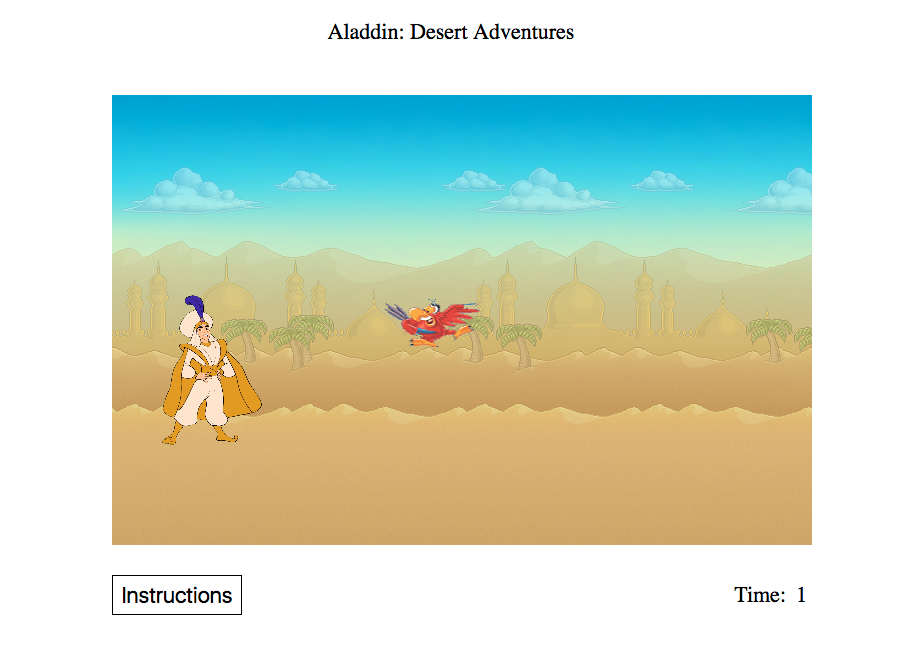

## Aladdin: Desert Adventures

[live site](https://harvey93.github.io)

### Background

Aladdin: Desert Adventures is a basic JavaScript game. The player controls Aladdin as Iago flies at him from different heights. The goal of the game is to survive as long as possible.



### Movement

Players play the game by pressing w to jump and s to duck as as Iago, Jaffar's friend and pet parrot flies in form the other side of the screen at different heights.


### Collision Detection

Collision detection is handled differently based on the state of Aladdin. If Aladdin is ducking, then a collision is detected if the y values of Aladdin and Iago are the same. If Aladdin is jumping then a collision is detected if the sum of the y value of Aladdin and its height is larger than the y value of Iago.

```
collision(rect1, rect2){
  if (rect2.y + rect2.height > rect1.y && rect2.state !== "ducked") {
      return true;
  }else if (rect2.state === "ducked" && rect2.y === rect1.y) {
    return true;
  }
}
```

### Increase In Difficulty

As Aladdin survives longer and the longer, the game gets more and more difficult to play as Iago flies faster and faster. I handled this by changing Iago's velocity property at specific time intervals.

```
calcProjVel(){
  if (parseInt(document.getElementById('timer').innerHTML) < 5) {
    return -14;
  }else if (parseInt(document.getElementById('timer').innerHTML) < 10) {
    return -18;
  }else if (parseInt(document.getElementById('timer').innerHTML) < 15) {
    return -22;
  }else {
    return -26;
  }
}
```

### Future Directions for the Project

There are many directions this this project  could eventually go.  Some anticipated updates are:

- [ ] Add ability to pick up coins in order to increase score
- [ ] Add double jump
- [ ] Add side to side movement for player
